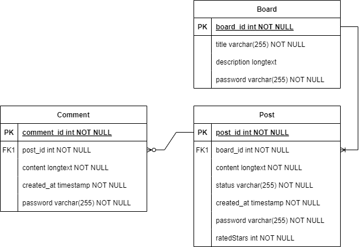

# 엘리스 1차 프로젝트 - CRUD 게시판 만들기

## 프로젝트 주제 : 스킨케어 제품 정보 공유 및 리뷰 게시판 "Glow Gallery"

## 개발 목적

: "글로우 갤러리"는 스킨케어 화장품에 관한 정보를 공유하고 리뷰하는 게시판입니다."글로우"는 건강하고 반짝이는 피부를 의미합니다. "갤러리"는 예술적인 표현이나 작품을 보관하는 곳이라는 의미입니다.

## 개발 목표

: "글로우 갤러리" 게시판은 사용자들이 화장품에 대한 정보를 쉽게 찾고 공유할 수 있는 게시판을 제공하는 것을 목표로 합니다. 사용자가 관심이 있는 카테고리에 대한 게시판을 만들 수 있고, 제품이나 브랜드에 대한 게시글을 작성할 수 있습니다. 게시물에 댓글을 작성하여 해당 제품에 대해 다른 의견이나 질문을 작성할 수 있습니다.

## 와이어 프레임
--

## 기능

: 게시판 생성, 조회, 수정, 삭제 기능
- 게시판 생성 시 비밀번호를 설정하여 수정/삭제 시 비밀번호 검증

: 게시글 생성, 조회, 수정, 삭제 기능
- 게시글 생성 시 비밀번호를 설정하여 수정/삭제 시 비밀번호 검증
- ⭐ 게시글은 스킨케어 제품이나 브랜드에 대한 1~5개의 별점을 남길 수 있음. (추가 기능)
- 게시글 제목으로 검색할 수 있음.
- 게시글을 최신순 또는 오래된 순으로 정렬할 수 있음.

: 댓글 생성, 조회, 수정, 삭제 기능
- 댓글 생성 시 비밀번호를 설정하여 수정/삭제 시 비밀번호 검증
- 댓글을 최신순 또는 오래된 순으로 정렬할 수 있음.

## 페르소나

이름: 미나 (Mina)

나이: 25세

직업: 회사원 (영업 부서)

관심사: 스킨케어, 뷰티 제품, 코스메틱

## ERD

